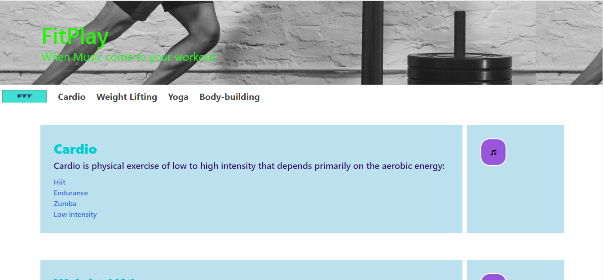

<h2>Fitplay</h2>
A web application to allow you to select a workout and music together to help you exercise even better. We offer amazing workouts that you will be amazed with and songs that would fit well. READY TO WORK OUT AND LISTEN TO MUSIC AT THE SAME TIME, WELL NOW IS THE BEST TIME TO DO SO.
Create an application that contains any type of workouts and music. The web app that you are about to create will be used with HTML, CSS, JavaScript, JQUERY, Bulma CSS, and Two API Keys. You will need to add the local storage which contains data for workouts and music.

https://stevenleonardo.github.io/project1/

<h2>Getting Started</h2>
First you lay down a html template to be able to target certain phrases on the page. After you can obtain the two
api key and run a ajax call for each one in javascript. After you will need to add a function that will listen for the
click on the page that is attached to the link or button that will redirect the user to the youtube video. Also you
will need to attach the second call(workout manager) so that the description will appear on the page into that function.

<h2>Prerequisites</h2>
Softwares needed for the project
    •   Visual Code
    •   Two API Key (YouTube API Key and Manager Workout API Key)
Files and Links for the project
    •   HTML File (must be called index.html)
    •   CSS File
    •   JavaScript File
    •   JQUERY Link
    •   Bulma CSS Link

<h2>Running test</h2>
The team used the google developer tools to be able to run test on the function and page. (ie. console.log())

<h2>Authors</h2>
Worked on by the amazing team CodeSlappers which include
-Steven Leonardo
-Yoom Davidson
-Shivan Desai
-Nardine Gergis